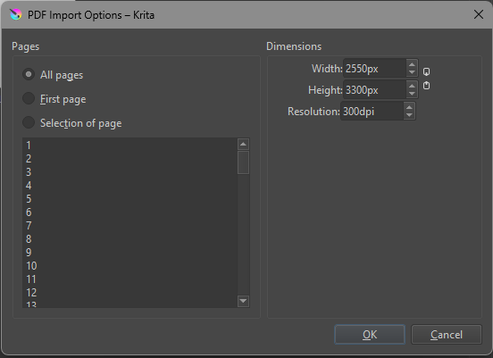
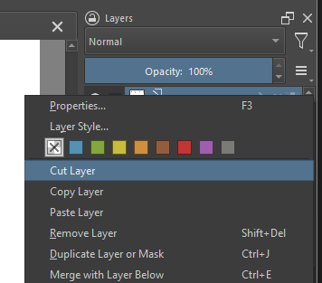
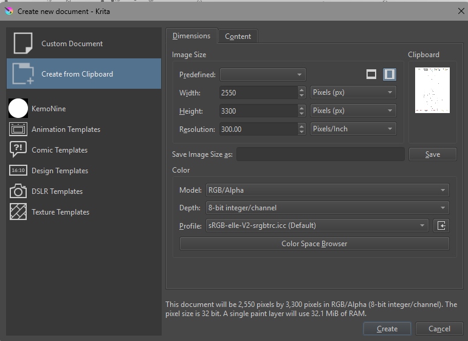
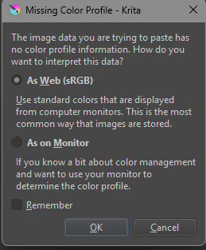
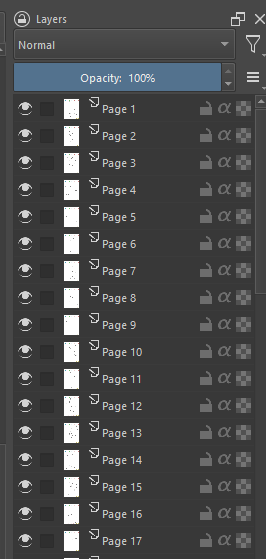

---
tags:
  - note
created_at: "2023-02-17"
source: "KemoNine Blog"
---

```table-of-contents
title: **Table of Contents**
```

---

## Changelog

2025-03-03
: Add Krita method & Note quirk with Sketchbook

2023-02-17
: Initial creation

## Using Sketchbook

I've not found a good way to use just Sketchbook for converting coloring pages from PDF. I've found Krita 'just works' for converting PDF to coloring pages. You can export files from Krita using the Photoshop (psd) format to retain the layers when opening in Sketchbook. Basicaly use Krita to convert the pages to Photoshop (psd) and then open the Photoshop (psd) file in Sketchbook.

## Using Krita

Krita can import PDF files and create a layer for each page of a PDF. This can be especially helpful when buying digital coloring pages. The below procedure can be used to convert a PDF of coloring pages (one or more pages) to individual Krita files that can be used to color digitally. This page only shows the PDF conversion, see the [Digital Coloring](/art/2022-02-16-digital-coloring/) post for more details on how to setup a Krita document for coloring.

### Conversion

1. Open the PDF with Krita
2. Select which pages to import as layers when prompted
3. Cut a single layer to remove it from the current drawing placing it on the clipboard
4. Create a new file from clipboard
5. Set the color profile as appropriate if prompted
6. Setup the new file as a coloring page


### Screen shots

#### The PDF import options prompt



#### The 'cut layer' operation



#### The new from clipboard prompt



#### The missing color profile prompt



#### The layers of a multi page PDF after import




## The 'Hard' Way

If you have access to `imagemagick` you can quickly convert a PDF coloring page(s) to grayscale PNG using the below procedure and notes.


### Notes

- The `pdfimages` will get you a dpi listing for each page in the PDF that has an image, use that value instead of `300` in the below, **if** it is present.
- The `-type Grayscale` parameter can be removed if you need color output. You probably want color output if you plan to color the converted page with actual color.


### Conversion

1. Install `imagemagick`
2. `pdfimages -list shipspage1.pdf`
3. ``for file in `ls *.pdf`; do convert -density 300 -type Grayscale ${file} ${file}.png; done``


## Resources

- [how-to-get-dpi-of-a-pdf-file](https://stackoverflow.com/questions/50006770/how-to-get-dpi-of-a-pdf-file)
- [convert_pdf_to_image_imagemagick](https://jdhao.github.io/2019/11/20/convert_pdf_to_image_imagemagick/)
- [convert-pdf-to-png-using-imagemagic](https://stackoverflow.com/questions/2869908/convert-pdf-to-png-using-imagemagick)
- [imagemagick.org discourse topic](https://legacy.imagemagick.org/discourse-server/viewtopic.php?t=11279)
