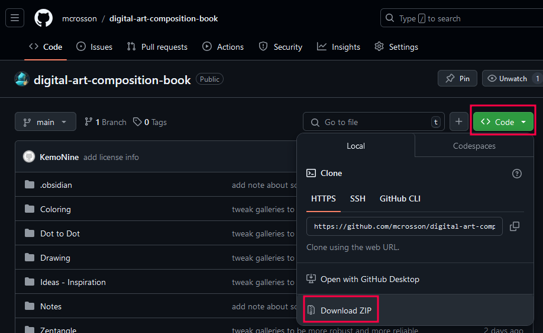
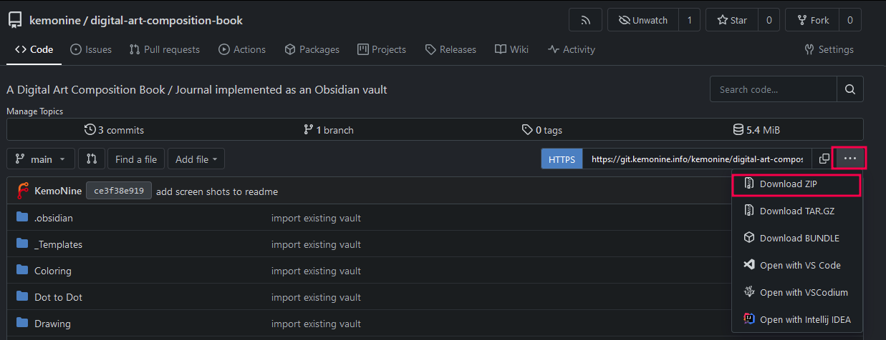

## The Digital Art Composition Book

This is a template [Obsidian](https://obsidian.md/) vault that is setup to act as a 'Digital Art Composition Book / Journal'.

Digital art may be 'rigid' and 'not notebook friendly' but this Obsidian vault can wrangle things into a digital notebook that's similar in feel to a paper composition book / journal. It's not perfect but it works well with the constraints 'digital' imposes.

## Additional Details

Please see the [__Using The Vault](Notes/__Using%20The%20Vault.md) file for additional detail how this vault can be used as a digital art composition book. Please note: some links on the `__Using The Vault` page will be broken when viewed from the website but *will* work properly when opened within Obsidian.

There are also screenshots below showing the vault in use.

## To use the vault template

- Download the files as a zip file (see below screenshot for detail)
- Extract the zip file
- Rename the folder contained within the zip file if desired
- Open the folder that was extracted in Obsidian as a vault
- Import any existing art as appropriate
- Enjoy

## Licensing

This project is licensed under the [Creative Commons BY-NC 4.0 International](https://creativecommons.org/licenses/by-nc/4.0/) license

## Downloading the vault as a zip file

### From GitHub (the main site)

### From Forgejo (KemoNine's personal site mirror)

## Screenshots

### Main Vault View

### KemoNine Zentangle View

### KemoNine Coloring View

